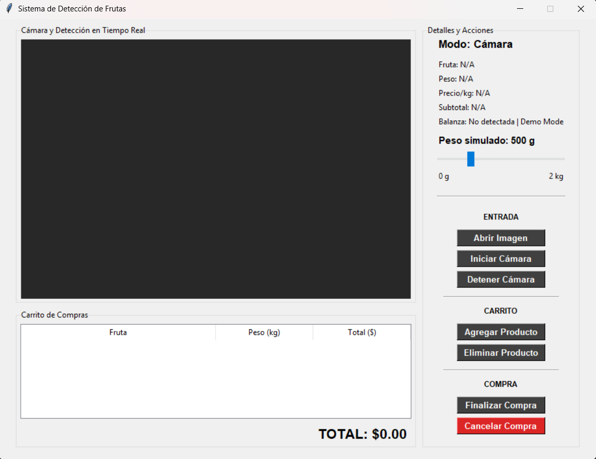
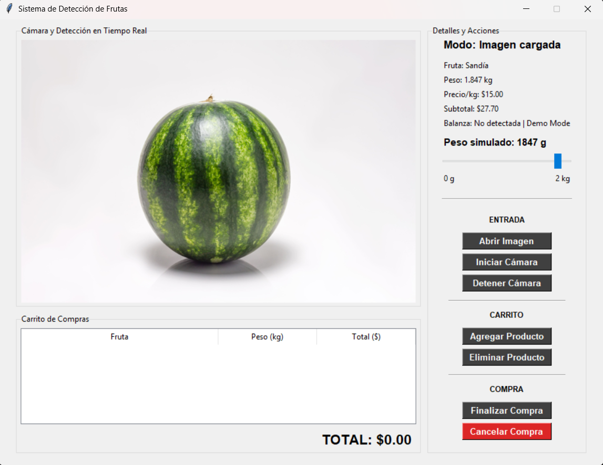
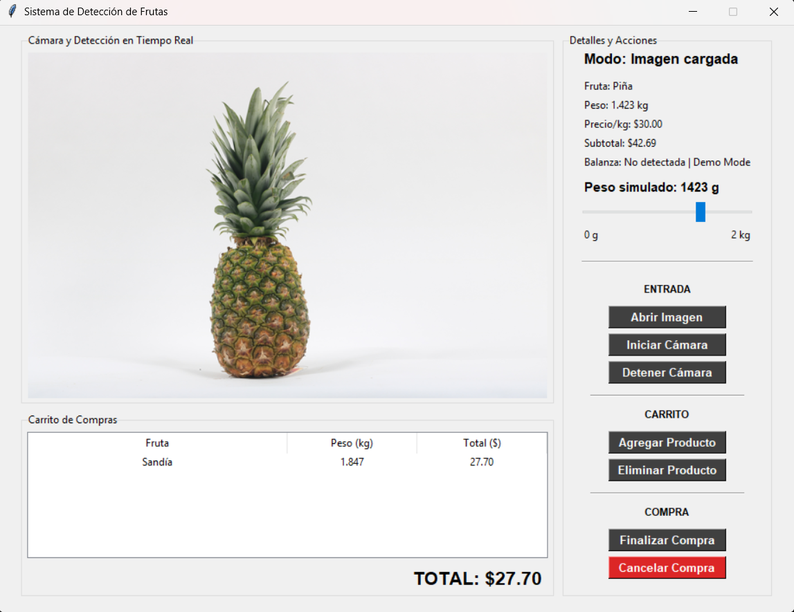
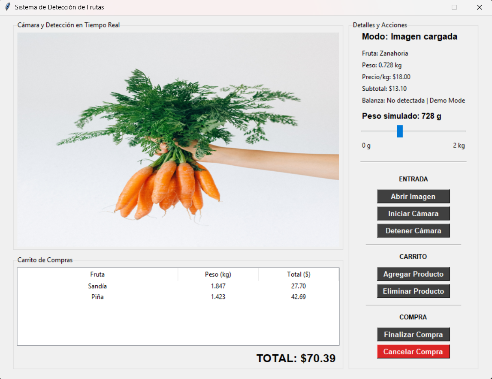
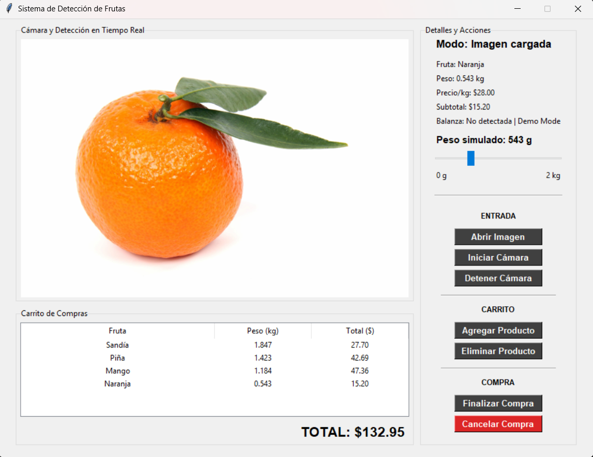

# Real-Time Fruit Detection

Desktop application for real-time fruit classification using TensorFlow and OpenCV.

The system combines computer vision with serial weight sensors to automate fruit recognition, price calculation, and shopping cart generation while also providing a complete demonstration mode that operates without external hardware.

Originally developed as part of research activities conducted at UABCS's Artificial Intelligence and Robotics Research Laboratory (LIDIAIR).

---

## 🎥 Demo

[](https://youtu.be/VIDEO_ID)

▶️ **[Watch Demo on YouTube](https://youtu.be/VIDEO_ID)**

The demonstration showcases the desktop interface, fruit recognition workflow, serial communication features, automated pricing process, and the complete shopping experience offered by the system.

---

## Features

- Real-time fruit classification
- Camera-based recognition workflow
- Integration with serial weight sensors
- Automatic price calculation
- Shopping cart generation
- Demonstration mode without external hardware
- Manual testing and simulation capabilities
- Session result visualization
- Desktop graphical interface

---

## Tech Stack

- Python
- TensorFlow
- Keras
- OpenCV
- Tkinter
- Serial Communication (PySerial)

---

## Screenshots

The screenshots below showcase the fruit detection system operating under different scenarios.

| Main Interface | Fruit Recognition | Shopping Cart |
|---|---|---|
|  |  |  |

| Demo Mode | Weight Integration | Final Purchase |
|---|---|---|
|  |  |  |

---

## Experimental Context

This project was developed as part of research activities at the Artificial Intelligence and Robotics Research Laboratory (LIDIAIR) at UABCS.

The primary objective was to explore practical applications of computer vision and embedded integration for retail environments by combining image classification with sensor-assisted automation.

Rather than focusing exclusively on image recognition accuracy, the project aimed to evaluate the complete interaction flow required to automate assisted purchasing experiences.

---

## System Workflow

The application follows the process below:

```text
Camera
   ↓
Fruit Classification Model
   ↓
Detected Product
   ↓
Weight Sensor (Serial)
   ↓
Price Calculation
   ↓
Shopping Cart
```

---

## Notes

This repository represents the final research-oriented implementation developed within LIDIAIR.

Although the system supports integration with external weight sensors, a complete demonstration mode was implemented to reproduce the user experience without requiring physical hardware.

This allows recruiters, reviewers, and researchers to explore the application regardless of equipment availability.

---

## Future Improvements

Potential future iterations could include:

- Support for additional fruit categories
- Expanded hardware compatibility
- Enhanced user interface refinements
- Exportable purchase reports
- Deployment on embedded devices
- Model retraining with larger datasets

---

## Research Context

This repository serves as a portfolio project demonstrating the integration of:

- Computer Vision
- Deep Learning
- Desktop Application Development
- Serial Communication
- Hardware-assisted Automation

through a practical real-world use case.
